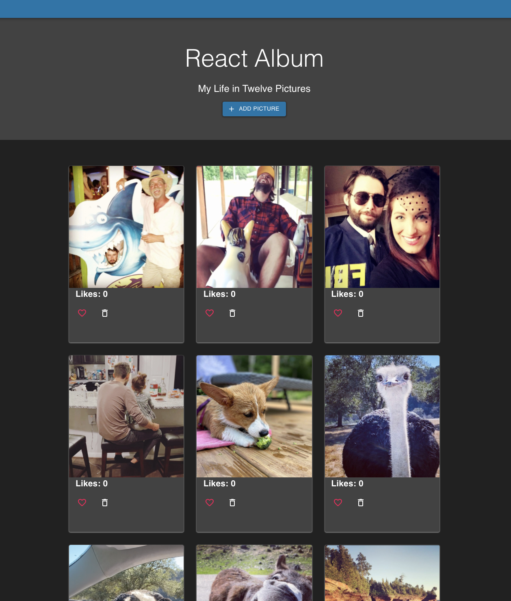

# WEEKEND REACT GALLERY

## Description
Weekend Challenge

The goal of this project was to create a photo gallery using React to build the webpage.  The app needed to contain multiple components that eliminated redundant code.  Photo urls/paths were stored in a postgreSQL database and accessed via pg and axios routes.  Buttons to Like and Delete were included.  Styling was improved using material-ui.

## Screen Shot

### Prerequisites

Link to software that is required to install the app (e.g. node).

- [Node.js](https://nodejs.org/en/)
- [PostgreSQL](https://www.postgresql.org/)
- [Postico](https://eggerapps.at/postico/)

## Installation

1. Create a database named `react_gallery`,
2. The queries in the `Database.sql` file are set up to create all the necessary tables and populate the needed data to allow the application to run correctly. The project is built on [Postgres](https://www.postgresql.org/download/), so you will need to make sure to have that installed. We recommend using Postico to run those queries as that was used to create the queries, 
3. Open up your editor of choice and run an `npm install`
4. Run `npm run server` in your terminal
5. Run `npm run client` in your terminal - will open up a new browser tab.

## Usage
How does someone use this application? Tell a user story here.

1. The album gallery is stored on a PostgreSQL database using url or file paths, along with descriptions of the image, and a Like count.
2. The pictures are pulled from the database and displayed in 'cards' using react and material-ui.
3. Clicking on a picture will toggle the picture off and toggle text describing the picture on.
4. Pictures can be Liked using the heart icon to increase the Like count.
5. Pictures can be permanently deleted from the database using the trashcan icon.
6. Clicking the ADD PICTURE button, will toggle-on a form that allows the user to enter in a picture url/path and a description of the image to submit to the database.

## Built With

- HTML/CSS
- Javascript
- Node
- Express
- Axios
- React
- PG
- Material UI

## Acknowledgement
Thanks to [Prime Digital Academy](www.primeacademy.io)!
